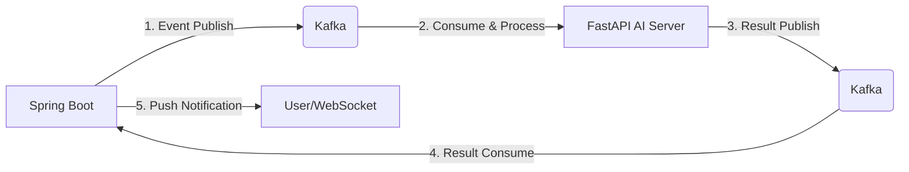

# 🐍 NewSnake (뉴스네이크)
> **AI 기반 뉴스 인사이트 분석 및 실시간 기업 영향도 랭킹 플랫폼**
> 


<p align="center">
  
  
  
  
  
  
  
</p>

---

## 🌐 서비스 바로가기
**[https://newsnake.site](https://newsnake.site)** (현재 운영 중)

---

## Project Overview
NewSnake는 사용자가 입력한 뉴스 URL을 기반으로 AI가:

- 3줄 요약

- 핵심 키워드 추출

- 연관 기업 도출

- 주가 영향도 예측 (상승 / 하락 / 보합)

을 수행하고, 이를 기반으로 **실시간 기업 검색 랭킹**을 집계하는 플랫폼입니다.

AI 분석은 평균 수십 초가 소요되는 장기 작업이므로,
동기 API 구조가 아닌 **비동기 이벤트 기반 아키텍처**로 설계되었습니다.

---


## 🏗 System Architecture (Cloud Native & Hybrid)


본 프로젝트는 고가용성, 확장성, 그리고 보안성을 최우선으로 고려하여 
**클라우드 환경 및 Managed Service**를 조합한 하이브리드 아키텍처로 설계되었습니다.


### 1. Compute & Containerization (OCI)

- **OCI Instance + Docker Compose**
  - Nginx와 Spring Boot를 컨테이너 기반으로 운영했습니다.
  - 개발 환경과 운영 환경의 차이를 줄이고, 배포 과정을 단순화했습니다.

- **Oracle Object Storage (정적 파일 분리)**
  - React 빌드 파일을 오브젝트 스토리지에 별도로 호스팅했습니다.
  - 정적 리소스와 API 서버를 분리하여 서버 부하를 줄이고 응답 속도를 안정화했습니다.

### 2. Aiven Managed Services

- **Aiven for Apache Kafka**
  - AI 분석 요청과 결과를 비동기 이벤트 방식으로 처리하기 위해 사용했습니다.
  - 직접 Kafka를 구축하지 않고 Managed Service를 활용해 운영 부담을 줄였습니다.

- **Aiven for Redis**
  - 외부 Redis를 중앙 캐시로 구성했습니다.
  - 인스턴스를 확장하더라도 모든 서버가 동일한 세션 및 실시간 랭킹 데이터를 공유할 수 있도록 설계했습니다.

### 3. AI Serving & Networking

- **Hugging Face Spaces**
  - FastAPI 기반 AI 서버를 별도 환경에서 운영하여 백엔드 서버와 AI 모델을 분리했습니다.

- **Cloudflare + GoDaddy**
  - 도메인과 DNS를 Cloudflare로 관리하고, SSL을 적용하여 전 구간 HTTPS 환경을 구성했습니다.
---

## 🚀 Key Features (핵심 기능)

### 1. AI 뉴스 분석 파이프라인
* **뉴스 분석**: URL 입력 시 AI가 본문을 스크래핑하여 **3줄 요약, 핵심 키워드, 연관 기업**을 도출합니다.
* **주가 예측**: 감성 분석(Sentiment Analysis)을 통해 해당 뉴스가 기업 주가에 미칠 영향(**상승/하락/보합**)을 예측합니다.
* **데이터 시각화**: 분석된 기업의 실시간 주가 그래프를 매칭하여 사용자에게 시각적인 통찰을 제공합니다.

### 2. 실시간 기업 영향도 랭킹
* **실시간 집계**: 분석 결과로 도출된 기업을 Redis의 **Sorted Set**에 즉시 반영하여 인기 순위를 실시간 산출합니다.
* **배치 시스템**: 매일 자정 **Spring Batch**를 통해 Redis의 실시간 데이터를 MySQL(`CompanyRankDaily`)로 이관(Upsert)하여 영구 보존합니다.

### 3. 커뮤니티 및 실시간 소통 (Community & Interaction)

*   **실시간 채팅 (Real-time Chat)**: WebSocket(STOMP) 기반의 채팅 시스템을 구축하여 뉴스 분석 결과를 바탕으로 사용자 간의 실시간 정보 공유 및 토론 환경을 제공합니다.
*   **기업별 소통 게시판**: 각 기업별 전용 게시판을 통해 댓글 및 반응(좋아요/싫어요) 기능을 지원하며, Redis를 활용해 대량의 리액션을 실시간으로 집계하고 정합성을 유지합니다.
*   **콘텐츠 가이드라인 (Clean Filter)**: 비속어 필터링 로직을 적용하여 건강한 커뮤니티 환경을 유지할 수 있도록 관리 시스템을 구축했습니다.


---

## 🔥 Technical Decisions (핵심 기술 의사결정)

### ✅ Managed Service 기반의 인프라 효율화
직접 구축 시 발생하는 운영 리소스를 최소화하고 서비스 로직 개발에 집중하기 위해 **Aiven Managed Service**를 선택했습니다.
특히 Kafka의 복잡한 클러스터 관리와 보안 설정을 클라우드 레벨에서 해결했습니다.

### ✅ 서버 다중화를 고려한 중앙 집중형 캐시 (Redis)
인스턴스 복제 시 발생하는 세션 파편화 문제를 해결하기 위해 **외부 Redis**를 도입했습니다.
이를 통해 로드 밸런서 하단의 어떤 서버로 접속하더라도 동일한 랭킹과 세션 정보를 보장받습니다.

### ✅ GitHub Actions를 활용한 CI/CD 무중단 배포
* **Backend**: 빌드 후 OCI 인스턴스로 Docker 컨테이너를 자동 배포합니다.
* **Frontend**: React 빌드 결과물을 Oracle Object Storage에 자동으로 동기화하여 배포 자동화를 구현했습니다.

---

## 🛠 테크 스택

| 분류 | 기술 스택 |
| :--- | :--- |
| **Backend** | Java 17, Spring Boot 3.x, Spring Data JPA, Spring Security |
| **Frontend** | React, JavaScript, CSS3 |
| **AI Server** | Python, FastAPI, Hugging Face NLP Models |
| **Managed Infrastructure** | **Aiven for Kafka**, **Aiven for Redis** |
| **Cloud** | **OCI (Oracle Cloud)**, Oracle Object Storage, Hugging Face Spaces |
| **DevOps** | **GitHub Actions**, Docker, Docker Compose, Nginx |
| **Network/Security** | Cloudflare, GoDaddy, HTTPS (SSL/TLS) |
---


## 📂 Project Structure & Core Modules

```bash
.
├── .github/workflows      # CI/CD (Spring Boot & React 배포 자동화)
├── docker-compose.yml     # Nginx & Spring Boot 컨테이너 설정
├── src/main/java/com/newsnake
│    ├── user              # 강력한 비밀번호 정책(연속 문자/배열 차단) 적용
│    ├── jwt               # Stateless JWT 인증 시스템
|    |    └── oauth             # OAuth2 소셜 인증 및 Auth Code Exchange 방식
│    ├── fastapi           # Kafka 기반 AI 분석 및 Redis 랭킹 최적화
│    │    ├── Kafka        # Producer(Transactional Listener), Consumer(Manual Ack)
│    │    └── optimization # Redis ZSet 실시간 집계 및 배치 이관 로직
│    └── mail              # Redis Stream 기반 신뢰성 비동기 알림 시스템
|
```

## 🧠 기술적으로 해결한 문제들

### 1️⃣ AI 장기 작업을 동기 처리하지 않음.
**🚨 Problem**
AI 뉴스 분석은 평균 **20~200초**가 소요되는 장기 작업입니다. 기존 동기(Sync) API 구조에서는 다음과 같은 병목이 발생했습니다.
* 요청 스레드의 장시간 점유 및 Thread Pool 고갈 위험
* 트래픽 증가 시 서버 전체 응답성 저하

**✅ 해결 방법**
요청 즉시 이벤트를 발행하고 제어권을 반환하는 **EDA(Event-Driven Architecture)**를 설계했습니다.


**결과**: 서버 스레드 점유율 0% 달성, 장기 작업 중에도 시스템 안정성 유지
  
---

## 2️⃣ 실시간 랭킹 집계를 DB에서 제거

### 🚨 Initial Problem

초기 구조에서는 원본 로그 테이블(FastApiEntity)을 직접 집계하여 실시간 랭킹을 계산했습니다.


sql
SELECT company, COUNT(*)
FROM FastApiEntity
GROUP BY company
ORDER BY COUNT(*) DESC;


**문제점**

*   데이터 증가에 따라 GROUP BY 집계 비용 선형 증가
*   p95 응답 시간 ~120ms 이상
*   DB CPU 사용량 지속 상승
*   트래픽 증가 시 구조적 병목 발생

👉 단순 인덱스 튜닝으로는 해결 불가한 구조적 문제

### ❌ Why Index Tuning Was Not Enough

`GROUP BY COUNT(*)` 연산은
데이터가 증가할수록 Full Scan + Aggregation 비용이 선형 증가

즉,

> 데이터 증가 = 응답 지연 증가

이는 단순 튜닝이 아닌 아키텍처 레벨 개선이 필요한 상황이었습니다.

### ✅ 해결 방법

집계 책임을 DB에서 제거하고, 실시간 데이터는 Redis에서 처리하도록 구조를 변경했습니다.

```
로그 저장 (MySQL)
→ Redis Sorted Set 실시간 증가
→ 자정에 일별 테이블로 압축 저장
→ 조회는 Redis에서만 수행
```

### 📈 결과

| 방식 | p95 응답 시간 |
| :--- | :--- |
| 원본 직접 집계 | ~120ms |
| Redis + 집계 테이블 | ~2ms |

👉 약 98% 성능 개선

또한 DB CPU 사용량이 안정화되며,
트래픽 증가에도 응답 시간 편차가 거의 발생하지 않도록 개선되었습니다.

---

## 3️⃣ Kafka Idempotent Processing Design (Kafka 중복 메시지 처리 설계)

Kafka는 at-least-once를 보장합니다.
즉, 같은 메시지가 2번 올 수 있습니다.

이를 그대로 반영하면 랭킹이 왜곡됩니다.

그래서 3단계로 막았습니다.

DB Unique Key

Redis processedKey 체크

Redis 분산 Lock

### 📈 결과

👉 메시지가 2번 와도 결과는 1번만 반영됩니다.
데이터 정합성을 보장했습니다.

✔ 데이터 정합성 보장
✔ 랭킹 왜곡 방지
✔ 이벤트 기반 시스템 안정성 확보

---

## 4️⃣ 실제 장애를 겪고 인프라를 다시 설계

### 🚨 AWS Free Tier 장애 경험

초기 운영 중 다음과 같은 문제가 발생했습니다.

*   인스턴스 재시작 루프
*   SSH 접속 불가
*   서비스 복구 지연
*   과금 지속 발생

👉 단순 배포 환경이 아닌 운영 관점 인프라 설계의 중요성을 체감

### ✅ OCI 기반 재설계

운영 안정성을 최우선으로 고려하여
네트워크 구조부터 재설계했습니다.

#### 🔐 Network Segmentation

*   **Public Subnet** – Nginx / API 서버
*   **Private Subnet** – DB 배치
*   DB 외부 접근 완전 차단

#### ⚙ 개선 방향

*   Load Balancer Liveness Check 적용
*   OCI Monitoring 알람 설정
*   비정상 인스턴스 자동 감지

👉 평균 30~60초 이내 장애 감지 가능

---
### 마무리

NewSnake는 단순 기능 구현 프로젝트가 아니라,
운영 중 발생한 병목과 장애를 직접 해결하며 구조를 개선해온 프로젝트입니다.

AI 비동기 처리, 실시간 집계 최적화, Kafka 정합성 설계,
멀티 클라우드 운영과 장애 대응까지 경험했습니다.

