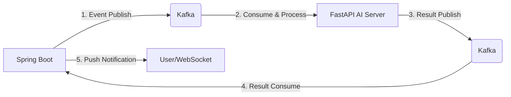

# 🐍 NewSnake (뉴스네이크)
> **AI 기반 뉴스 인사이트 분석 및 실시간 기업 영향도 랭킹 플랫폼**
> 


<p align="center">
  
  
  
  
  
  
  
</p>

---

## 🌐 서비스 바로가기
**[https://newsnake.site](https://newsnake.site)** (현재 운영 중)

---

## Project Overview
NewSnake는 사용자가 입력한 뉴스 URL을 기반으로 AI가:

- 3줄 요약

- 핵심 키워드 추출

- 연관 기업 도출

- 주가 영향도 예측 (상승 / 하락 / 보합)

을 수행하고, 이를 기반으로 **실시간 기업 검색 랭킹**을 집계하는 플랫폼입니다.

AI 분석은 평균 수십 초가 소요되는 장기 작업이므로,
동기 API 구조가 아닌 **비동기 이벤트 기반 아키텍처**로 설계되었습니다.

---


## 🏗 System Architecture (Cloud Native & Hybrid)
```bash
User
  ↓
Cloudflare (DNS + SSL + Edge Proxy)
  ↓
Nginx (Reverse Proxy)
  ↓
Spring Boot (API Server, OCI)
  ↓
Kafka (Aiven)
  ↓
FastAPI (Hugging Face Spaces)
  ↓
Kafka
  ↓
Spring Boot
  ↓
Redis (Sorted Set)
  ↓
WebSocket
  ↓
User
```
본 프로젝트는 고가용성, 확장성, 그리고 보안성을 최우선으로 고려하여 **이기종 클라우드 환경 및 Managed Service**를 조합한 하이브리드 아키텍처로 설계되었습니다.


### 1. Compute & Containerization (OCI)
* **OCI Instance**: Oracle Cloud 인스턴스 내 **Docker Compose**를 활용하여 **Nginx(Reverse Proxy)**와 **Spring Boot** 서버를 컨테이너 기반으로 운영합니다.
* **Static Hosting (Oracle Object Storage)**: React 빌드 파일을 오브젝트 스토리지에 호스팅하여 정적 리소스의 응답 속도를 극대화하고 서버 자원 효율을 높였습니다.

### 2. Intelligent Data Pipeline (Aiven Managed Services)
* **Aiven for Apache Kafka**: Spring Boot와 FastAPI 간의 이음새 역할을 하며, 뉴스 분석 요청 및 결과 데이터를 **비동기 이벤트 방식**으로 중계합니다. (SSL/TLS 보안 적용)
* **Aiven for Redis**: 
    * **Scale-out 전략**: 로드 밸런싱을 통해 인스턴스를 복제/확장할 때, 모든 서버가 동일한 실시간 데이터 및 세션 정보를 공유할 수 있도록 외부 중앙 집중형 캐시 서버로 구축했습니다.

### 3. AI Serving & Networking
* **Hugging Face Spaces**: FastAPI 기반 AI 모델을 독립적인 도메인으로 서빙하여 백엔드 부하를 차단하고 모델 업데이트의 유연성을 확보했습니다.
* **Cloudflare & GoDaddy**: GoDaddy 도메인을 Cloudflare로 관리하며, Cloudflare의 Edge Proxy와 SSL 인증서를 통해 전 구간 HTTPS 보안을 구축했습니다.

---

## 🚀 Key Features (핵심 기능)

### 1. AI 뉴스 분석 파이프라인
* **Insight Extraction**: URL 입력 시 AI가 본문을 스크래핑하여 **3줄 요약, 핵심 키워드, 연관 기업**을 도출합니다.
* **Stock Prediction**: 감성 분석(Sentiment Analysis)을 통해 해당 뉴스가 기업 주가에 미칠 영향(**상승/하락/보합**)을 예측합니다.
* **Visual Data**: 분석된 기업의 실시간 주가 그래프를 매칭하여 사용자에게 시각적인 통찰을 제공합니다.

### 2. 실시간 기업 영향도 랭킹
* **Real-time Count**: 분석 결과로 도출된 기업을 Redis의 **Sorted Set**에 즉시 반영하여 인기 순위를 실시간 산출합니다.
* **Batch Persistence**: 매일 자정 **Spring Batch**를 통해 Redis의 실시간 데이터를 MySQL(`CompanyRankDaily`)로 이관(Upsert)하여 영구 보존합니다.


---

## 🔥 Technical Decisions (핵심 기술 의사결정)

### ✅ Managed Service 기반의 인프라 효율화
직접 구축 시 발생하는 운영 리소스를 최소화하고 서비스 로직 개발에 집중하기 위해 **Aiven Managed Service**를 선택했습니다. 특히 Kafka의 복잡한 클러스터 관리와 보안 설정을 클라우드 레벨에서 해결했습니다.

### ✅ 서버 다중화를 고려한 중앙 집중형 캐시 (Redis)
인스턴스 복제 시 발생하는 세션 파편화 문제를 해결하기 위해 **외부 Redis**를 도입했습니다. 이를 통해 로드 밸런서 하단의 어떤 서버로 접속하더라도 동일한 랭킹과 세션 정보를 보장받습니다.

### ✅ GitHub Actions를 활용한 CI/CD 무중단 배포
* **Backend**: 빌드 후 OCI 인스턴스로 Docker 컨테이너를 자동 배포합니다.
* **Frontend**: React 빌드 결과물을 Oracle Object Storage에 자동으로 동기화하여 배포 자동화를 구현했습니다.

---

## 🛠 Tech Stack

| 분류 | 기술 스택 |
| :--- | :--- |
| **Backend** | Java 17, Spring Boot 3.x, Spring Data JPA, Spring Security |
| **Frontend** | React, JavaScript, CSS3 |
| **AI Server** | Python, FastAPI, Hugging Face NLP Models |
| **Managed Infrastructure** | **Aiven for Kafka**, **Aiven for Redis** |
| **Cloud** | **OCI (Oracle Cloud)**, Oracle Object Storage, Hugging Face Spaces |
| **DevOps** | **GitHub Actions**, Docker, Docker Compose, Nginx |
| **Network/Security** | Cloudflare, GoDaddy, HTTPS (SSL/TLS) |
---


## 📂 Project Structure & Core Modules

```bash
.
├── .github/workflows      # CI/CD (Spring Boot & React 배포 자동화)
├── docker-compose.yml     # Nginx & Spring Boot 컨테이너 설정
├── src/main/java/com/newsnake
│    ├── user              # 강력한 비밀번호 정책(연속 문자/배열 차단) 적용
│    ├── oauth             # OAuth2 소셜 인증 및 Auth Code Exchange 방식
│    ├── jwt               # Stateless JWT 인증 시스템
│    ├── fastapi           # Kafka 기반 AI 분석 및 Redis 랭킹 최적화
│    │    ├── Kafka        # Producer(Transactional Listener), Consumer(Manual Ack)
│    │    └── optimization # Redis ZSet 실시간 집계 및 배치 이관 로직
│    └── mail              # Redis Stream 기반 고신뢰성 비동기 알림 시스템
└── nginx/conf.d           # Reverse Proxy 및 Cloudflare SSL 설정
```

## 🧠 Engineering Highlights

### 1️⃣ Event-Driven Architecture 도입 (비동기 처리 최적화)
**🚨 Problem**
AI 뉴스 분석은 평균 **20~200초**가 소요되는 장기 작업입니다. 기존 동기(Sync) API 구조에서는 다음과 같은 병목이 발생했습니다.
* 요청 스레드의 장시간 점유 및 Thread Pool 고갈 위험
* 트래픽 증가 시 서버 전체 응답성 저하

**✅ Solution**
요청 즉시 이벤트를 발행하고 제어권을 반환하는 **EDA(Event-Driven Architecture)**를 설계했습니다.


**결과**: 서버 스레드 점유율 0% 달성, 장기 작업 중에도 시스템 안정성 유지


